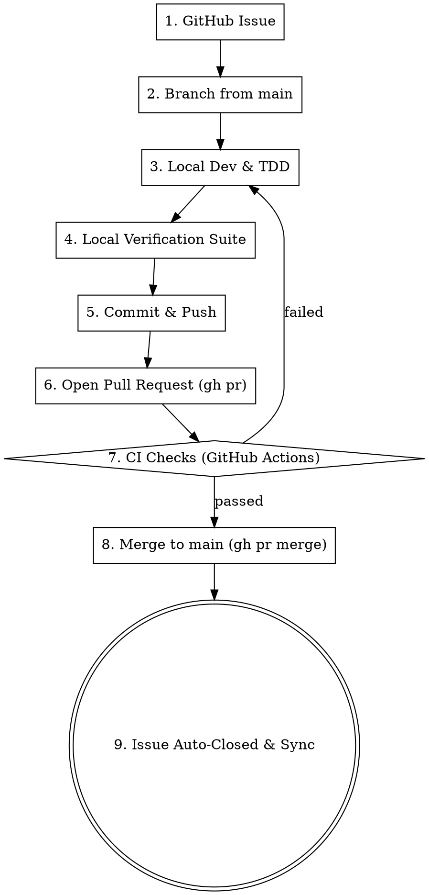

# Agent Instructions for PressHub AI

Welcome to the **PressHub** repository. This document outlines the standard operating procedures, workflows, security rules, debugging tools, and verification tasks for all autonomous agents and developers contributing to the codebase.

---

## 🏗️ Repository Architecture

- **`presshub-ai-editor/`**: The core WordPress plugin source code.
  - `includes/`: PHP classes (API client, token logger, structured logger, rate limiter, admin presets, metaboxes, podcast producer, news curator/harvester, settings).
  - `assets/`: Frontend/Admin JavaScript and CSS.
  - `tests/`: Isolated PHP unit test suite (49 test files + `run-all-tests.php`).
- **`presshub-workflow/`**: TypeScript workflow and MCP server components (Jest test suite).
- **`dev-env/`**: Fully configured, self-contained local WordPress development and testing environment powered by the official WordPress Core SQLite database engine (zero external database services required).

---

## ⚡ Local Development Environment

All ongoing development, feature work, bug fixes, and live testing **must** utilize the local WordPress development environment located in `dev-env/`.

### 1. Direct Code Linking
The plugin in `dev-env/wordpress/wp-content/plugins/presshub-ai-editor` is a direct filesystem junction (`mklink /J`) pointing to `presshub-ai-editor/` in the repository root.
- **No manual copying or rebuilding is required** when modifying PHP, JS, or CSS files in `presshub-ai-editor/` — changes are live immediately.
- **Live Branch Sync**: When switching branches in git, the junction dynamically reflects the current checked-out branch in WordPress.

### 2. Environment Credentials & Endpoints
- **Front-end URL**: `http://127.0.0.1:8888`
- **WP Admin URL**: `http://127.0.0.1:8888/wp-admin/`
- **Admin Username**: `admin`
- **Admin Password**: `password123`
- **REST API Base**: `http://127.0.0.1:8888/wp-json/presshub-ai/v1/`
- **Database File**: `dev-env/wordpress/wp-content/database/.ht.sqlite`

### 3. Starting the Dev Server
To start the local WordPress web server:
```bash
php dev-env/scripts/server.php
```

### 4. Setup & Re-provisioning
If starting on a clean clone or resetting the environment:
```bash
php dev-env/scripts/setup.php
```

---

## 🪵 Debugging & Log Access

The environment is configured with `WP_DEBUG = true`, `WP_DEBUG_LOG = true`, `SAVEQUERIES = true`, and structured PressHub logging enabled.

### Live Log Streaming & Filtering Tool
Use `dev-env/scripts/tail-logs.php` to monitor both WordPress core errors and PressHub AI plugin logs:

```bash
# View recent 50 lines from all sources
php dev-env/scripts/tail-logs.php

# Live stream logs in real time (follow)
php dev-env/scripts/tail-logs.php --follow

# Filter by log level (DEBUG, INFO, WARNING, ERROR)
php dev-env/scripts/tail-logs.php --level=ERROR

# Filter by source
php dev-env/scripts/tail-logs.php --source=presshub   # PressHub plugin logs only
php dev-env/scripts/tail-logs.php --source=wp         # WordPress core debug.log only

# Filter by search keyword
php dev-env/scripts/tail-logs.php --search="rate limit"

# Clear log files
php dev-env/scripts/tail-logs.php --clear
```

### Raw Log File Paths
- **WordPress Core Debug Log**: `dev-env/wordpress/wp-content/debug.log`
- **PressHub Structured Log**: `dev-env/wordpress/wp-content/uploads/presshub-ai/presshub-debug.log`

---

## 🗄️ Database & Token Log Inspection

The database is an SQLite database containing all standard WordPress tables plus custom plugin tables like `wp_presshub_ai_token_logs` (managed by `PressHub_AI_Token_Logger`).

### 1. Token & Activity Log Inspector
Inspect LLM token usage, provider latencies, models, errors, and JSON metadata:

```bash
# View recent 25 activity/token logs
php dev-env/scripts/view-token-logs.php

# View aggregate token counts, request totals, and provider breakdowns
php dev-env/scripts/view-token-logs.php --stats

# Filter by provider or status
php dev-env/scripts/view-token-logs.php --provider=openai
php dev-env/scripts/view-token-logs.php --provider=anthropic
php dev-env/scripts/view-token-logs.php --status=error

# View full record details and JSON metadata for a specific record ID
php dev-env/scripts/view-token-logs.php --detail=1

# Output as JSON
php dev-env/scripts/view-token-logs.php --json
```

### 2. SQL Query CLI & Table Schema Inspector
Run raw SQL queries against the local WordPress database:

```bash
# List all database tables and row counts
php dev-env/scripts/query-db.php --tables

# Inspect schema of any table
php dev-env/scripts/query-db.php --schema wp_presshub_ai_token_logs
php dev-env/scripts/query-db.php --schema wp_options

# Execute arbitrary SQL queries
php dev-env/scripts/query-db.php "SELECT * FROM wp_options WHERE option_name LIKE 'presshub%' LIMIT 10"
php dev-env/scripts/query-db.php "SELECT provider, model, total_tokens, duration_ms, status FROM wp_presshub_ai_token_logs ORDER BY id DESC LIMIT 5"
```

### 3. WP-CLI
Execute WP-CLI commands against the local instance:
```bash
# Via Windows batch wrapper
dev-env\bin\wp plugin list
dev-env\bin\wp user list
dev-env\bin\wp eval "echo get_option('presshub_ai_log_level');"

# Or via PHP
php dev-env/bin/wp-cli.phar --path=dev-env/wordpress <command>
```

### 4. Database Reset / Reseed
Wipe and restore a fresh WordPress installation with the admin user, sample test post, and active plugin in 1 second:
```bash
php dev-env/scripts/reset-db.php
```

---

## 🔒 Security & Hardening Standards

All code contributions must strictly adhere to WordPress security best practices:

1. **Nonce Verification**:
   - Every AJAX action and form POST must verify nonces via `check_ajax_referer( 'presshub_ai_nonce', 'nonce' )` or `check_admin_referer()`.
2. **Capability & Authorization Checks**:
   - All admin endpoints and settings modifications must enforce explicit user capability gates (`current_user_can( 'manage_options' )` or filtered capability `apply_filters( 'presshub_ai_settings_cap', 'manage_options' )`).
3. **Data Sanitization & Escaping**:
   - **Input Sanitization**: Always sanitize input using `sanitize_text_field()`, `sanitize_textarea_field()`, `sanitize_key()`, `esc_url_raw()`, and `wp_unslash()`.
   - **Output Escaping**: Always escape output in templates and HTML renders using `esc_html()`, `esc_attr()`, `esc_url()`, `esc_textarea()`, or `wp_kses_post()`.
4. **Secret Redaction**:
   - Never log unmasked API keys or secret tokens into `debug.log`, token log metadata, or client-side JavaScript payloads.
   - Always mask API keys displaying only prefix and suffix (e.g. `sk-pr••••••••3x9K`).

---

## ⚙️ Settings-First Principle (Anti-Pattern Guard)

> **No operational limit, threshold, cap, time budget, batch size, retry count, or rate limit that affects user-visible behavior may be hard-coded as a default inside business logic.** Every such value **must** be a WordPress option exposed in the **Settings** page (`PressHub AI → Settings`), with:
>
> 1. A registered option key (e.g. `presshub_ai_<scope>_<knob>`).
> 2. A `register_setting()` call with a `sanitize_callback` that clamps the value to documented safe bounds.
> 3. A `sanitize_<knob>` static method on `PressHub_AI_Settings_Storage`.
> 4. A `get_<knob>` static helper on `PressHub_AI_Settings_Storage` returning the clamped value with a documented default.
> 5. An `add_settings_field()` row on the relevant settings section.
> 6. A `render_<knob>_field()` method on the settings render class.
>
> Consumers must read the value via the storage helper, **not** via `get_option()` + `apply_filters()` defaults.

### Rationale

Hard-coded `apply_filters( 'presshub_ai_*_max_*', N )` defaults in business logic are a **silent anti-pattern**: the limit is invisible to the operator, the value drifts from one another (max-articles vs max-chars vs time-budget), and a regression like the 2026-08-29 380k-token curation run (Issue #39) cannot be diagnosed without grepping the code. The plugin already has the correct pattern (see `presshub_ai_harvest_time_budget` + `PressHub_AI_Settings_Storage::get_harvest_time_budget()` as a reference implementation). All new operational knobs must follow it.

### Examples of *what* this rule applies to

- Article / token / character caps on LLM prompts (e.g. `presshub_ai_curation_max_articles`, `presshub_ai_curation_max_chars_per_article`).
- HTTP timeouts, retry counts, backoff windows.
- Per-user rate-limit thresholds and windows.
- Token log retention days, batch sizes for TTS, model temperature defaults.
- Any new value matching the regex `/max_|min_|_limit|_threshold|_timeout|_retries|_budget/`.

### What this rule does **not** apply to

- Pure constants that are part of a protocol (e.g. `RESEARCH_POLL_MAX_ATTEMPTS = 40` in `assets/sidebar.js` is a polling-safety fallback, not a user-tunable limit — but it should be documented in the class docblock and a Settings option must back it if the operator asks to change it).
- Truly internal magic numbers with no user-visible effect (e.g. array sort flags, regex flags, file-lock retry counts inside `WP_Filesystem`).
- Defaults inside `PressHub_AI_*` classes that are *immediately* re-read by a Settings helper — those defaults are the *fallback* for a missing option, not the authoritative value.

### Enforcement

When reviewing a PR, look for any of these patterns in `presshub-ai-editor/includes/`:

```php
// 🚫 Forbidden
$value = apply_filters( 'presshub_ai_some_max_knob', 40 );
$value = (int) get_option( 'presshub_ai_some_max_knob', 40 ); // without a sanitize_/get_ helper

// ✅ Required
$value = PressHub_AI_Settings_Storage::get_some_max_knob();
```

If a PR introduces a new operational knob without the full six-step registration, request changes citing this section.

---

## 🧪 Verification & Testing Protocol

Before marking any task, bugfix, or feature as complete, you **MUST** run all verification test suites:

### 1. Live WordPress Integration Tests
Validates plugin activation, database tables, logger outputs, options persistence, and AJAX action registrations against the live WordPress runtime:
```bash
php dev-env/scripts/run-integration-tests.php
```

### 2. Plugin Unit Tests (49 test files)
Runs all unit tests in process-isolated PHP runners:
```bash
php presshub-ai-editor/tests/run-all-tests.php
```

### 3. Workflow TypeScript Tests (if touching workflow / MCP code)
```bash
cd presshub-workflow
npm test
npx tsc --noEmit
cd ..
```

### 4. PHP Syntax Verification
Ensure no syntax errors in modified PHP files:
```bash
php -l presshub-ai-editor/presshub-ai-editor.php
php -l presshub-ai-editor/includes/<modified-file>.php
```

### 5. CI Failure Verification During PR Review
When acting as a PR reviewer, never blindly trust a PR author's claim that a CI failure is a "known issue," "environmental flakiness," or "baseline failure." You **MUST** inspect the actual CI failure logs (e.g., using `gh run view <run-id> --log-failed`) to verify that the specific failed assertions and stack traces exactly match the known baseline issue. If the failure differs, it is a new regression introduced by the PR and must be addressed before the PR can be merged.

---

## 👁️ Visual Inspection, Browser Tool & Screenshot Verification

As part of the QA pipeline, agents **must** perform a visual inspection of all frontend or admin UI changes in the local testing environment:

1. **Start Local Dev Server**:
   - Ensure the local development server is running (`php dev-env/scripts/server.php`).
2. **Utilize Browser Automation Tools**:
   - Agents can use the **`browser-automation` MCP tools** (`navigate`, `get_content`, `click_element`, `fill_element`) or headless browser runners to automate browser workflows.
   - **Automated Login**: Navigate to `http://127.0.0.1:8888/wp-login.php`, fill `#user_login` with `admin`, `#user_pass` with `password123`, and submit.
   - **Navigate to Interface**: Directly load the modified view (e.g. `http://127.0.0.1:8888/wp-admin/admin.php?page=presshub-ai` or `http://127.0.0.1:8888/wp-admin/post-new.php`).
3. **Verify Visual & Interactive States**:
   - Verify layout alignment, typography, and component rendering.
   - Test interactive UI state variations: **Empty states**, **Loading/Spinner states**, **Active states**, **Error/Validation alerts**, and **Modal dialogs**.
   - Check responsive layouts across standard desktop (1280x800) and mobile viewports.
4. **Record Screenshots & Visual Artifacts**:
   - Capture screenshots of the "before" and "after" states (or the final state of the feature/fix).
5. **Attach Evidence**:
   - Attach or reference these screenshots in the Pull Request description or walkthrough artifact to provide undeniable visual proof that the fix renders correctly.

---

## 📋 GitHub Issue Tracking Protocol & Best Practices

All bugs, regressions, edge cases, and feature tasks identified during development or debugging **must** follow this rigorous investigation and GitHub issue tracking lifecycle.

### 1. Pre-Issue Investigation Protocol
Before creating any GitHub issue, thoroughly examine the problem in the local development environment:
1. **Reproduce & Isolate**: Run the relevant test suite, trigger the AJAX/REST endpoint, or reproduce the issue in WordPress admin (`http://127.0.0.1:8888`).
2. **Collect Evidence**:
   - Inspect WordPress & plugin debug logs: `php dev-env/scripts/tail-logs.php --level=ERROR`
   - Inspect database token & activity records: `php dev-env/scripts/view-token-logs.php --status=error` or `--detail=<id>`
   - Query relevant tables/options: `php dev-env/scripts/query-db.php "SELECT ..."`
3. **Identify Root Cause**: Pinpoint the exact file, class, function, or SQL query responsible.
4. **Line-number drift between issue body and current source**: Issue bodies cite line numbers that matched the file at the time the issue was filed. After any commit touches that file, the line numbers shift. Always re-locate the exact code in the **current** file via `grep_search` or `view_file` before editing — issue bodies are authoritative on intent, not on line numbers. When opening a PR, explicitly state in the description when the cited line numbers have shifted.

### 2. Issue Categorization & Severity Taxonomy

Every GitHub issue **must** be tagged with appropriate labels across three dimensions:

| Dimension | Label | Criteria |
| :--- | :--- | :--- |
| **Type / Category** | `bug` | Defects, runtime crashes, regressions, or unexpected behaviors |
| | `enhancement` | New features or improvements to existing capabilities |
| | `security` | Security vulnerabilities, authorization checks, secret leak vectors |
| | `performance` | Latency issues, unindexed DB queries, memory bloat |
| | `refactor` | Code modernization or cleanup without changing external behavior |
| | `documentation` | Docs, README, or AGENTS.md updates |
| **Severity** | `severity:critical` | Fatal errors (500s/white screen), data corruption, data loss, security exploits |
| | `severity:high` | Major functionality broken (e.g. LLM calls completely failing, DB token table unreachable) |
| | `severity:medium` | Moderate defect with workaround; UI glitch impeding editorial workflow |
| | `severity:low` | Minor cosmetic issue, notice/deprecation warnings, typo |
| **Component** | `component:editor` | Gutenberg editor, sidebar, chat UI, metaboxes |
| | `component:api-client`| LLM API client adapters (OpenAI, Anthropic, Gemini, Groq) |
| | `component:logger` | Token logger, structured logger, DB logging tables |
| | `component:settings` | Admin settings page, provider store, preset store |
| | `component:workflow` | Editorial workflow, audio synthesis, podcast producer, deep research |

---

### 3. Creating Structured GitHub Issues
Use standard conventional titles (`type(scope): description`) and apply all 3 taxonomic labels:

```bash
gh issue create \
  --title "bug(component): Concise summary of the issue" \
  --label "bug,severity:high,component:api-client" \
  --body "### 📝 Summary
Clear explanation of what is failing and why.

### 📍 Impacted Files & Components
- \`presshub-ai-editor/includes/class-xyz.php\` (\`Class_Name::method_name()\`)

### 🔍 Reproduction & Evidence
**Steps to Reproduce:**
1. Step 1
2. Step 2

**Debug Logs / DB Excerpts:**
\`\`\`
[Excerpt from tail-logs.php or view-token-logs.php]
\`\`\`

### 🔬 Root Cause Analysis
Technical explanation of why the failure occurs.

### 💡 Proposed Solution
Concrete implementation plan or proposed code changes.

### 🔗 Related Issues & Dependencies
- Relates to #X
- Blocked by #Y"
```

### 4. Issue Linking & Relationship Best Practices
- **Cross-Referencing**: When filing an issue related to, caused by, or resolving another issue, explicitly reference `#<id>` in the body or via comment:
  ```bash
  gh issue comment <id> --body "Relates to #<other-id>: shares common root cause in rate-limiter."
  ```
- **Duplicate / Superseded**: If an issue replaces another:
  ```bash
  gh issue close <old-id> --comment "Superseded by #<new-id>."
  ```
- **Resolving in Commits & PRs**: Use GitHub closing keywords in commit messages and PR descriptions:
  - `Fixes #12` / `Closes #12` / `Resolves #12`

### 5. Verification & Closing Protocol
An issue may **only** be closed when the fix is fully verified:
1. Live WordPress integration tests pass: `php dev-env/scripts/run-integration-tests.php`
2. Plugin unit test suite passes: `php presshub-ai-editor/tests/run-all-tests.php`
3. Verified via local dev server / logs that the bug no longer occurs.
4. Close with verification summary:
   ```bash
   gh issue close <issue-number> --comment "Fixed and verified in local dev environment. All unit tests and live integration tests passed cleanly."
   ```

---

## 🔄 Complete Software Development Life Cycle (SDLC) & Git Workflow

All bug fixes, enhancements, and features **must** follow this structured end-to-end SDLC from issue creation to main branch merge:



---

### Step 1: Issue Selection & Branch Creation

1. Inspect open issues and select the target issue ID:
   ```bash
   gh issue list --state open
   gh issue view <issue-id>
   ```

2. Always branch off the latest `main` branch:
   ```bash
   git checkout main
   git pull origin main
   git checkout -b <type>/issue-<id>-<short-description>
   ```
   *Branch Naming Examples:*
   - `fix/issue-1-fresh-install-provider-defaults`
   - `feat/issue-2-dynamic-model-discovery`
   - `fix/issue-3-max-tokens-truncation`
   - `feat/issue-6-news-source-manager`

> [!NOTE]
> **Live Junction Behavior during Branch Switching:**
> The directory junction `dev-env/wordpress/wp-content/plugins/presshub-ai-editor` dynamically reflects whatever branch is currently checked out in git. Switching branches automatically updates the plugin inside WordPress with zero manual re-linking or copy commands.

---

### Step 2: Implementation & Local TDD Cycle

1. **Write or Update Tests First**:
   - Add/update unit test file in `presshub-ai-editor/tests/*Test.php`.
   - Add integration test cases in `dev-env/scripts/run-integration-tests.php` if new database tables, options, or REST/AJAX endpoints are introduced.

2. **Implement Code Changes**:
   - Edit PHP/JS/CSS files in `presshub-ai-editor/` or TypeScript in `presshub-workflow/`.
   - Ensure clean coding standards, proper docstrings, and escaping (`esc_html`, `esc_attr`, `sanitize_text_field`).

3. **Verify Locally against Dev Environment**:
   - Check real-time logs: `php dev-env/scripts/tail-logs.php --level=ERROR`
   - Check database records: `php dev-env/scripts/view-token-logs.php` or `php dev-env/scripts/query-db.php "..."`
   - Test UI in WordPress Admin: `http://127.0.0.1:8888/wp-admin/`
   - Capture screenshots for any modified UI views.

#### Scope expansion beyond an issue's literal list
When `replace_file_content` with `AllowMultiple=true` (or any other auto-expanding tool) matches more sites than the issue body explicitly enumerated:
1. **Verify** each additional match is the same defect (byte-identical or semantically identical pattern).
2. **Verify** the additional sites are required to actually resolve the bug, not just convenient to bundle.
3. **Disclose** the expansion explicitly in the PR body under a "Scope note" or similar heading, citing the additional sites and the reason for inclusion.
4. **Never** silently expand scope beyond what an issue cites without disclosure.

---

### Step 3: Mandatory Pre-Commit Verification Gate

Before committing, you **MUST** run all verification test suites and ensure a 100% clean pass rate:

```bash
# 1. Plugin Unit Tests (All 49+ test suites)
php presshub-ai-editor/tests/run-all-tests.php

# 2. Live WordPress Integration Tests
php dev-env/scripts/run-integration-tests.php

# 3. Workflow TypeScript Tests (if touching workflow / MCP)
cd presshub-workflow && npm test && npx tsc --noEmit && cd ..

# 4. PHP Syntax Lint
php -l presshub-ai-editor/presshub-ai-editor.php
php -l presshub-ai-editor/includes/<modified-files>.php
```

---

### Step 4: Conventional Commits

Commit changes with conventional commit messages explicitly referencing the issue number:

```bash
git add presshub-ai-editor/ includes/ ...
git commit -m "fix(settings): prevent pre-populating active providers on clean install (Fixes #1)"
```

---

### Step 5: Push Branch & Open Pull Request (`gh pr create`)

1. Push your branch to GitHub:
   ```bash
   git push -u origin <branch-name>
   ```

2. Create a Pull Request linking the issue with closing keywords:
   ```bash
   gh pr create \
     --title "fix(settings): prevent pre-populating active providers on fresh install" \
     --base main \
     --body "### 📝 Summary
   Prevents \`PressHub_AI_Provider_Store::migrate_legacy_options()\` from seeding active default providers when no legacy options exist on a clean install.

   ### 🧪 Verification
   - [x] \`php presshub-ai-editor/tests/run-all-tests.php\` passed (100%)
   - [x] \`php dev-env/scripts/run-integration-tests.php\` passed (100%)
   - [x] Verified clean state in local dev environment
   - [x] Visual inspection and screenshots verified

   Closes #1"
   ```

3. Monitor GitHub Actions CI workflow:
   ```bash
   gh pr checks
   gh run list --limit 3
   ```

---

### Step 6: Merge Pull Request into `main` (`gh pr merge`)

1. Once CI checks pass and the PR is approved, merge the PR into `main` using squash or rebase:
   ```bash
   gh pr merge <pr-number> --squash --delete-branch
   ```

2. Verify that GitHub automatically closes the corresponding issue via the closing keyword (`Closes #<id>` / `Fixes #<id>`).

---

### Step 7: Local Sync & Post-Merge Verification

1. Checkout `main` and pull the latest merged code:
   ```bash
   git checkout main
   git pull origin main
   ```

2. Run the live integration test suite against the updated `main` branch to guarantee environment stability:
   ```bash
   php dev-env/scripts/run-integration-tests.php
   ```

---

## 🪟 Windows / PowerShell Quoting & Tooling Discipline

PressHub development runs on Windows PowerShell. The following pitfalls
recur and must be avoided:

1. **Never chain commands with `&&` / `||` / `;` in `run_command`.** PowerShell parses these as separate statements and rejects them with `The token '&&' is not a valid statement separator`. Run one command per `run_command` invocation, or write a `.ps1` script file via `write_to_file` and invoke it.
2. **Never use Bash-isms (`grep`, `sed`, `awk`, `cat`, `&&`, `$VAR`).** Use PowerShell-native equivalents: `Select-String`, `Get-Content`, `Set-Content`, `Where-Object`, `ForEach-Object`, etc.
3. **Never pass PHP / shell scripts with `$variable` references through `php -r "..."`.** The `$` is expanded by PowerShell *before* PHP sees the source, producing a `PHP Parse error: syntax error, unexpected token '\\'`. Write the script to a scratch file under `<appDataDir>/brain/<conversation-id>/scratch/` and invoke it as `php <scratch-file>.php`.
4. **Long / multi-line / multi-paragraph strings to CLI tools must be passed via `--body-file <path>` or stdin pipe (`-c -`), not as inline `-c "..."`.** PowerShell splits long quoted arguments at whitespace. The `--body-file` and stdin-pipe patterns both work; inline does not.
5. **`gh issue close` accepts `-c <comment>` (not `--comment-file`).** For multi-line comments, pipe the file via stdin: `Get-Content -Raw file.md | gh issue close N -c -`.
6. **`gh pr create` accepts `--body-file <path>`.** Always use this for PR bodies longer than a few lines.

---

## 🐙 GitHub CLI (`gh`) Reference

```bash
# Issues Management
gh issue list                     # List open issues
gh issue list --state all         # List all issues (open + closed)
gh issue view <id>                # View issue details & comments
gh issue create                   # Create a new issue (interactive or with flags)
gh issue comment <id> --body "…"  # Add a comment or cross-reference
gh issue close <id> --comment "…" # Close issue with closing comment
gh issue reopen <id>              # Reopen an issue

# CI & Actions Workflows
gh run list --limit 5             # View recent workflow runs
gh run view <run-id> --log-failed # Inspect failed CI run logs

# Pull Requests & Releases
gh pr list                        # List pull requests
gh pr view <id>                   # View PR details
gh pr checks <id>                 # Check status of PR CI checks
gh pr merge <id> --squash         # Merge PR into main branch
```
